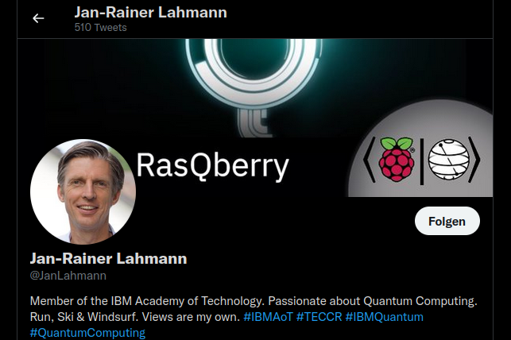

# Kapitel 3

Unser Code mit Login: [https://github.com/ohioh/IntroductionQuantumComputing/tree/main/GettingStarted](https://github.com/ohioh/IntroductionQuantumComputing/tree/main/GettingStarted)

Qiskit Tutorials:



Hello World @ Quantum



The Coin Game:

[https://github.com/qiskit-community/qiskit-community-tutorials/blob/master/games/Quantum-Coin-Game.ipynb](https://github.com/qiskit-community/qiskit-community-tutorials/blob/master/games/Quantum-Coin-Game.ipynb)
