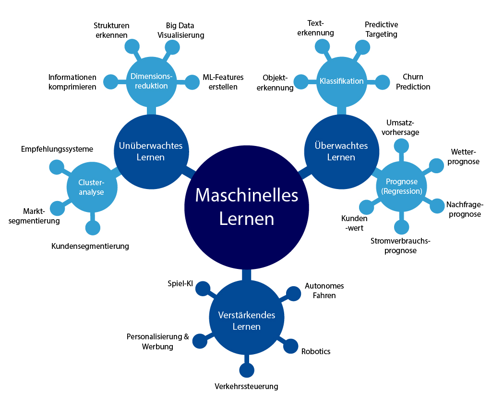

# ClassicalMachineLearning

[Machinelles Lernen](https://de.wikipedia.org/wiki/Maschinelles\_Lernen) :  Basierend auf vorhandenen Daten wird ein [statistisches Modell](https://de.wikipedia.org/wiki/Statistisches\_Modell) aufgebaut und getestet. Dies kann dann genutzt werden um im Produktiv-Einsatz Entscheidungen zu treffen.

.png>)

scikit-learn:&#x20;

* Simple and efficient tools for predictive data analysis
* Accessible to everybody, and reusable in various contexts
* Built on NumPy, SciPy, and matplotlib
* Open source, commercially usable - BSD license



Numpy:

The fundamental package for scientific computing with Python

[https://numpy.org/learn/](https://numpy.org/learn/)

Pandas:

**pandas** is a fast, powerful, flexible and easy to use open source data analysis and manipulation tool, built on top of the [Python](https://www.python.org) programming language.

[https://pandas.pydata.org/docs/user\_guide/index.html](https://pandas.pydata.org/docs/user\_guide/index.html)
